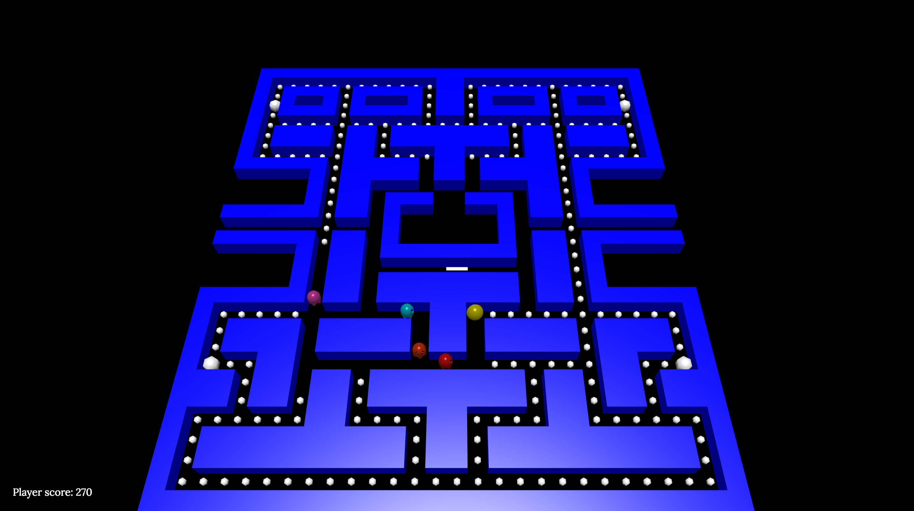

# Final Project Computer Graphics - Pacman #
*A game of Pacman*

## **Table of Content** ##
- [**Overview**](#overview)
  - Theme / Setting / Genre
  - Core Gameplay Mechanics Brief
  - Targeted platforms
  - Project Scope
  - Project Description
- [**Story and Gameplay**](#story-and-gameplay)
  - Story (Brief)
  - Story (Detailed)
  - Gameplay (Brief)
  - Gameplay (Detailed)
- [**Assets Needed**](#assets-needed)
  - 2D
  - 3D
  - Animation
- [**Schedule**](#schedule)

## **Overview** ##
### Theme / Setting / Genre ###
- **Theme**
  - Retro Game
- **Setting**
  - Mysterious Maze
- **Genre**
  - Arcade

### Core Gameplay Mechanics Brief ###
- Main Objective : Eat All Available Pellets
- Player Lose when Ghost collide with Pacman
- When Pacman eats the power pellet, ghost become scared
- Scared Ghosts returns to their base

### Targeted platforms ###
- Web Based
- Any recent desktop version of Firefox, Chrome, Edge or Safari.

### Project Scope ###
- **Game Time Scale**
  - 51 Days (5th of April’17 to 26th of May’17)

- **The Team**
  - Stanislaus Krisna (1901498492 / [krisnarocks][4eb6040a])
    - Game logic programmer
  - Andre Valentino (1901531546 / [glaciesice][09a79b58])
    - Character modelling and video editing
  - Fenbert (1901523286 / [fenbertlim][3d05666e])
    - Video content and game mechanics

- **Library Used**
  - Require.js ([https://github.com/requirejs/requirejs](https://github.com/requirejs/requirejs))
  - Babylon.js ([https://github.com/BabylonJS/Babylon.js](https://github.com/BabylonJS/Babylon.js))
  - Hand.js ([https://github.com/deltakosh/handjs](https://github.com/deltakosh/handjs))

### Project Description ###
Pac Man is an old fashioned 2D retro game. This project’s objective is to upgrade the old game and take it to the next level by implementing it in a 3D world.

## **Story and Gameplay** ##
### Story ###
Pac-man is a story of a guy who had a dream about becoming a pilot. But all cannot be done because he is trapped in a maze which is guarded by some ghost. The ghosts is who blocks his dream is his own fear. To pursue his dream, Pac-man should eat all the pills to free himself from the ghosts.

### Gameplay ###
The objective of this game is to eat all of the pellets available in the map. There are two kinds of pellets, the regular pellet and the power pellet. Regular pellet gives 10 points and it is distributed all across the map. Then, there is the power pellet which gives 50 points each but there is only 4 of it in the map. What makes power pellet special is that when the player eats the pellet, the player turns the ghosts eatable for eight seconds and immobilize the eaten ghosts for one second. When the pac-man eat the ghosts, pac-man will be rewarded by 200 points for each ghosts eaten. All Points are calculated on the bottom left corner of the browser. There are 2 warp portals on the left and the right. Both warp portals warps to each other. If pac-man collides with the ghosts, pac-man will die and the game ends by losing. When all available pellets in the map is finished, pac-man will end the game by winning.

## **Assets Needed** ##
### 2D ###
No 2D assets where used
### 3D ###
- Characters List
  - Pacman
  - Red Ghost
  - Orange Ghost
  - Pink Ghost
  - Blue Ghost
  - Scared Ghost (Hidden)
- Environmental Art Lists
  - Default cube primitives

### Animation ###
- Character Animations
  - Player
    - Pacman’s Mouth Animation
  - NPC
    - Ghost’s Floating Animation for moving

## **Schedule** ##

  [4eb6040a]: https://github.com/krisnarocks "Stanislaus Krisna's Github"
  [09a79b58]: https://github.com/glaciesice "Andre Valentino's Github"
  [3d05666e]: https://github.com/fenbertlim "Fenbert's Github"
